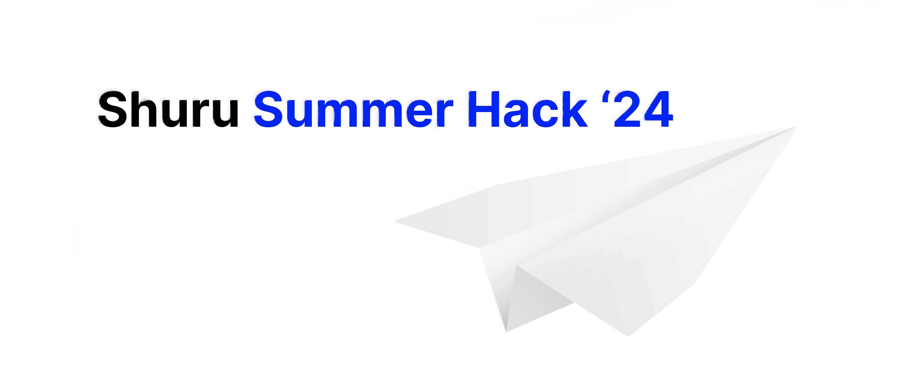

<div align="center">

# *Shuru Summer Hack '24*: Building a No-Code AI Agent Playground
<br>

#### ```Think of a space where you can create and interact with digital characters that can chat, learn, and adapt. What would you build? Who would you create?```

<br>
Our goal is to make AI tools more accessible and user-friendly. We want to create a no-code tool where people can design, deploy, and chat with personalized AI agents in a simple and intuitive way. <br>
Would you invite other agents into your playground? Would you keep the playground public? <br> Think of fun interactions that could take place between the agents and users! <br>
Over the month of June, you'll work on a range of challenges, from designing UI/UX and character avatars, to developing AI script systems and building a web interface. We'll provide the resources and support – you bring your coding skills!

</div>


### What is AutoGen?

AutoGen is a framework that enables the development of LLM applications using multiple agents that can converse with each other or to solve tasks. AutoGen agents are customizable, conversable, and seamlessly allow human participation. They can operate in various modes that employ combinations of LLMs, human inputs, and tools.

### Installation

To get started with AutoGen, follow the installation instructions: [Installation | AutoGen](https://microsoft.github.io/autogen/docs/installation/)

### Configure AutoGen

Learn how to configure AutoGen for your LLM application: [LLM Configuration | AutoGen](https://microsoft.github.io/autogen/docs/topics/llm_configuration/)

### Running LLMs Locally

To run LLMs locally, use the following tools:

* [ollama/ollama](https://github.com/ollama/ollama): Get up and running with Llama 3, Mistral, Gemma, and other large language models.
* [LM Studio](https://lmstudio.ai/): Discover, download, and run local LLMs
* [Use AutoGen for Local LLMs | AutoGen](https://microsoft.github.io/autogen/blog/2023/07/14/Local-LLMs/)

### Tutorials and Guides

* [Introduction: AutoGen Tutorial 🚀 : Create custom AI agents easily](https://www.youtube.com/watch?v=vU2S6dVf79M&list=PLp9pLaqAQbY2vUjGEVgz8yAOdJlyy3AQb&index=2)
* [Autogen Full beginner Course](https://www.youtube.com/watch?v=JmjxwTEJSE8)
* [Tutorial: Autogen Full Beginner Course : Build agentic AI apps with the AutoGen framework](https://www.youtube.com/watch?v=FkFKWVQytnY)
* [FAQs related to AutoGen](https://microsoft.github.io/autogen/docs/FAQ/#set-your-api-endpoints): Frequently asked questions

### Advanced Topics

* [Using your own custom model: AutoGen with Custom Models](https://microsoft.github.io/autogen/blog/2024/01/26/Custom-Models/): Empowering users to use their own inference mechanism

### AutoGen Studio

* [AutoGen Studio 2.0: AI Development UI](https://autogen-studio.com/autogen-studio-ui): A web-based interface for building AI agents

### Examples

* [Simple Chat](https://github.com/microsoft/autogen/blob/main/samples/simple_chat.py): A basic chatbot example
* [Two Agent](https://github.com/microsoft/autogen/blob/main/test/twoagent.py): An example of two agents conversing with each other
* [Agent GroupChat](https://github.com/microsoft/autogen/blob/main/notebook/agentchat_groupchat.ipynb): An example of multiple agents conversing in a group chat
* [Nested Chats](https://microsoft.github.io/autogen/docs/notebooks/agentchat_nestedchat): Solving complex tasks with nested chats
* [AutoGen All Examples](https://microsoft.github.io/autogen/docs/Examples): A collection of all AutoGen examples


### Judging Criteria

The whole process can be divided into subtasks and we will be judging your submissions based on these smaller tasks. Your overall score will depend on how well you perform in these individual tasks. 
We also encourage every team member to understand each stage of the process so that you build the best tool possible.


